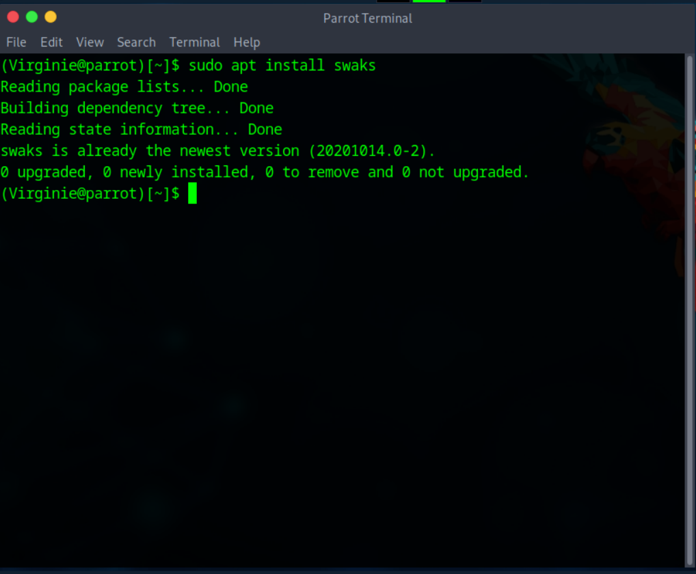
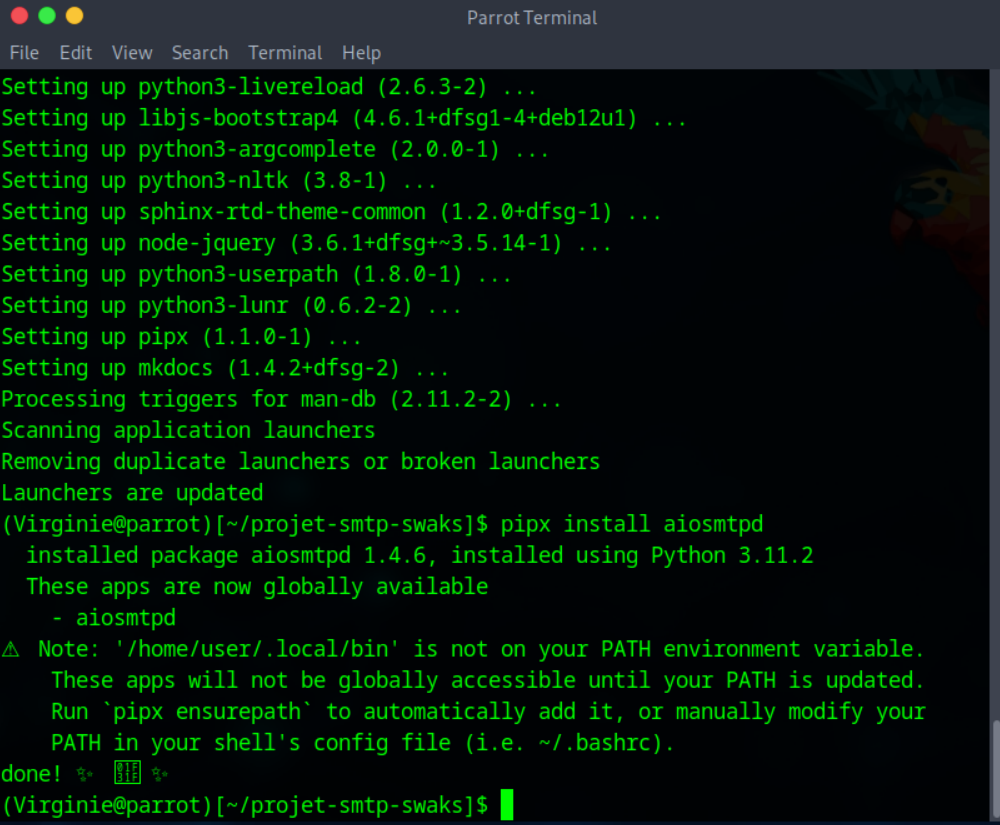
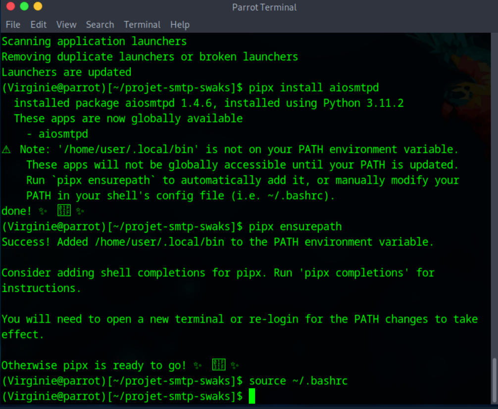
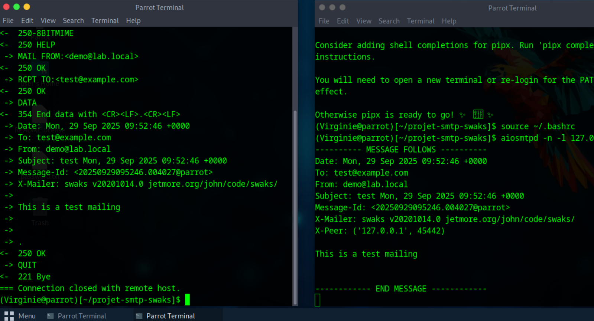

# Test SMTP pédagogique avec **swaks** (guide & labo)

**Niveau :** pentester / ingénierie sécurité (pédagogique, contrôlé)  
⚠️ **Usage pédagogique uniquement** - Tous les tests décrits ici sont réalisés en local dans une VM Parrot OS ou dans un laboratoire isolé. Avant toute action sur des systèmes réels, **obtenez une autorisation écrite** (Rules of Engagement).

## Résumé
Ce projet montre comment :
- créer un **serveur SMTP local** (simulation avec `aiosmtpd`),  
- tester l’envoi d’e-mails avec `swaks`,  
- observer le **dialogue SMTP** côté client/serveur,  
- vérifier et interpréter les protections e-mail : **SPF, DKIM, DMARC, TLS**.

# Introduction

## Qu’est-ce que SMTP ?

**SMTP** (*Simple Mail Transfer Protocol*) est le protocole standard utilisé pour l’envoi de courriels sur Internet.  
Il définit comment un client (ex. un logiciel de messagerie ou un script) communique avec un serveur de messagerie pour transmettre un message électronique.  

Points essentiels :  
- SMTP fonctionne en mode texte : les échanges se font sous forme de commandes et de réponses lisibles.  
- Par défaut, SMTP ne vérifie pas l’authenticité de l’expéditeur → c’est pourquoi il est vulnérable au **spoofing** (usurpation d’adresse e-mail).  
- Pour sécuriser les échanges, on ajoute des mécanismes comme **STARTTLS/TLS**, **SPF**, **DKIM** et **DMARC**.

---

## Qu’est-ce que Swaks ?

**Swaks** (*Swiss Army Knife for SMTP*) est un outil en ligne de commande conçu pour tester et diagnostiquer les serveurs SMTP.  
Il est particulièrement utilisé en sécurité et en administration système car il permet de :  
- simuler l’envoi d’un e-mail avec des paramètres personnalisés,  
- observer en détail le dialogue SMTP entre le client et le serveur,  
- tester des mécanismes de sécurité comme **STARTTLS**, **authentification SMTP**, **SPF/DKIM/DMARC**,  
- générer des traces exploitables dans un rapport d’audit ou de formation.  

---

## Objectifs pédagogiques
- Comprendre le dialogue SMTP (EHLO/HELO, MAIL FROM, RCPT TO, DATA).  
- Illustrer pourquoi SMTP par défaut permet, l'usurpation d'expéditeur (spoofing).  
- Vérifier et interpréter SPF / DKIM / DMARC et STARTTLS/TLS.  
- Produire des artefacts (sorties swaks, logs) exploitables en audit pédagogique.

## Contenu du dépôt (extrait)
- `README.md` - introduction (ce fichier).  
- `docs/demo_smtp_swaks.md` - guide pas-à-pas (installation, création serveur local, tests).  
- `docs/protections_email.md` - explication SPF/DKIM/DMARC/TLS et recommandations.  
- `ROE_MINI.md` - modèle minimal Rules of Engagement (lecture obligatoire).  
- `scripts/run_demo.sh` - script safe (local only) : démarre serveur local, lance swaks, sauvegarde traces.  
- `artifacts/` - sorties de tests (texte).  

## Règles d'or (lecture obligatoire)
- N'exécutez jamais ces scripts sur des hôtes tiers ou en production sans autorisation explicite.  
- Utilisez `example.com` dans la documentation publique et anonymisez les données réelles dans `artifacts/`.  
- Conservez les preuves dans `artifacts/` et anonymisez-les avant publication.

## Prochaines étapes rapides
1. Lisez `ROE_MINI.md`.  
2. Suivez `docs/demo_smtp_swaks.md` pour lancer la démo en local (Parrot OS).  
3. Sauvegardez les artefacts générés dans `artifacts/`.  
4. Complétez `docs/protections_email.md` avec vos conclusions.

---

# Démo SMTP - Swaks + aiosmtpd (guide pas à pas)

> Tout se fait **en local** sur une VM Parrot OS ou dans un laboratoire isolé. N’exécutez jamais ces procédures sur des systèmes tiers sans autorisation écrite.

## Objectifs
Montrer comment:
-  créer un serveur SMTP local (aiosmtpd) pour capter des messages de test ;
-  envoyer des e-mails de test avec `swaks` ;
-  observer et interpréter le dialogue SMTP (client ↔ serveur) ;
-  sauvegarder des artefacts (traces) exploitables pour un rapport pédagogique.

---

## Prérequis (VM Parrot OS / système de type Debian)

- Système à jour :
sudo apt update && sudo apt upgrade -y

-  Installer les outils de base :
sudo apt install -y swaks dnsutils openssl git

## Installation - capture
**Capture d'écran - installation de `swaks`**

  

*Figure : sortie montrant la commande `sudo apt install swaks` (swaks déjà installé sur la VM Parrot).*

---

# Installer pipx puis aiosmtpd (méthode recommandée) :

sudo apt install -y pipx
pipx ensurepath
# relancer le shell si nécessaire :
   source ~/.bashrc
  
pipx install aiosmtpd

### Capture d'écran - installation de `aiosmtpd` avec pipx

  

**Figure :** sortie montrant la commande `pipx install aiosmtpd` et le message de succès  
(aiosmtpd installé et disponible localement).

**Remarque :** si `pipx` n’est pas souhaité, vous pouvez utiliser un environnement virtuel Python :  

python3 -m venv .venv  
source .venv/bin/activate  
pip install --upgrade pip  
pip install aiosmtpd  

Créez les dossiers :

mkdir -p ~/projet-smtp-swaks/{docs,scripts,artifacts}  
cd ~/projet-smtp-swaks

1) Démarrer le serveur SMTP local (Terminal A)

Lancez aiosmtpd pour écouter sur l’interface locale (port 1025) :

aiosmtpd -n -l 127.0.0.1:1025

•	-n : ne pas daemoniser (le serveur reste au premier plan et affiche les messages reçus).
•	Laissez ce terminal ouvert : il affichera les messages au format brut (en-têtes + corps).

*Figure : sortie montrant la commande `pipx install aiosmtpd` suivie de `pipx ensurepath`.*

**Capture d’écran — ajout au PATH et rechargement du shell**

  

*Figure : commande `pipx ensurepath` puis `source ~/.bashrc`.*

---

2) Envoyer un e-mail de test avec Swaks (Terminal B)

Dans un autre terminal, exécutez :

cd ~/projet-smtp-swaks
swaks --to test@example.com \
      --from demo@lab.local \
      --server 127.0.0.1 --port 1025 \
      --header "Subject: Test SMTP local" \
      --body "Ceci est un test local. Date: $(date -u)" \
      --timeout 15 \
  | tee artifacts/test_local_aiosmtpd_$(date +%Y%m%d_%H%M%S).txt

Vous obtiendrez :
	•	la trace complète de la transaction SMTP dans la sortie standard (affichée par swaks);
	•	un fichier texte horodaté dans artifacts/ contenant la sortie (utile pour le rapport).

**Capture d’écran - envoi d’un e-mail de test avec Swaks**

  

*Figure : dialogue SMTP complet (EHLO, MAIL FROM, RCPT TO, DATA, QUIT).*

*Figure : trace complète du dialogue SMTP (`MAIL FROM`, `RCPT TO`, `DATA`, `250 OK`) observée avec Swaks et le serveur local aiosmtpd.*

---

3) Interpréter le dialogue SMTP (ce qu’il faut vérifier)

Lors d’une transaction réussie, observez les étapes suivantes :
	•	220 : salutation du serveur (prêt)
	•	EHLO / HELO : présentation du client (capabilities)
	•	MAIL FROM: : adresse déclarée de l’expéditeur (champ déclaratif)
	•	RCPT TO: : destinataire déclaré
	•	DATA → 354 : serveur attend le corps du message
	•	. → 250 OK : message accepté
	•	QUIT → 221 : fin de session

Remarque pédagogique : SMTP de base n’authentifie pas le champ MAIL FROM. C’est pourquoi SPF/DKIM/DMARC et l’authentification sont nécessaires côté destinataire.

---

4) Sauvegarder et vérifier les artefacts

Lister les artefacts :

ls -lh artifacts/

Afficher le contenu d’un artefact :

less artifacts/test_local_aiosmtpd_*.txt

Conservez ces fichiers dans le dépôt (ou hors dépôt si sensibles) pour preuve et reporting. Anonymisez avant publication.

---

5) Test TLS / STARTTLS (conceptuel)

Si vous souhaitez observer la négociation TLS avec un serveur externe (ex. smtp.gmail.com), utilisez :

swaks --to test@example.com --from demo@lab.local \
      --server smtp.gmail.com --port 587 --starttls --timeout 20 \
  | tee artifacts/test_starttls_$(date +%Y%m%d_%H%M%S).txt

Attention : de nombreux fournisseurs exigent une authentification pour la remise ; la connexion peut aussi être bloquée par la NAT/FAI. Ce test sert principalement à vérifier la présence et la négociation TLS.

---

6) Vérification DNS (lecture seule) - SPF / DKIM / DMARC

Exemples avec dig (remplacez example.com par le domaine de test) :

dig +short MX example.com
dig +short TXT example.com             # rechercher v=spf1
dig +short TXT _dmarc.example.com      # enregistrement DMARC
dig +short TXT selector._domainkey.example.com  # test DKIM (selector)

Interprétez :
	•	Absence de SPF/DKIM/DMARC → domaine vulnérable au spoofing.
	•	DMARC p=none → monitoring ; p=quarantine/p=reject → enforcement.

---

7) Nettoyage

Si aiosmtpd a été lancé en arrière-plan, arrêtez-le :

pkill -f aiosmtpd || true

