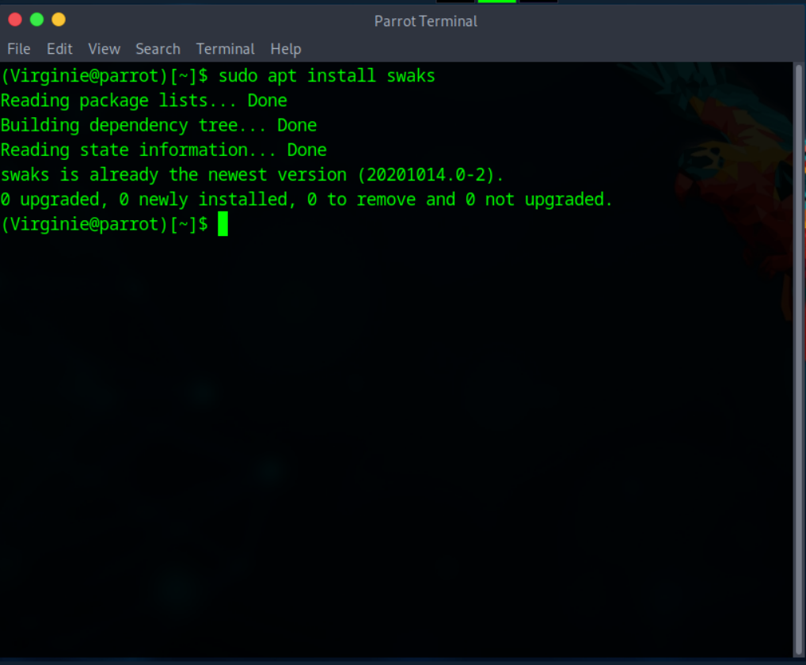
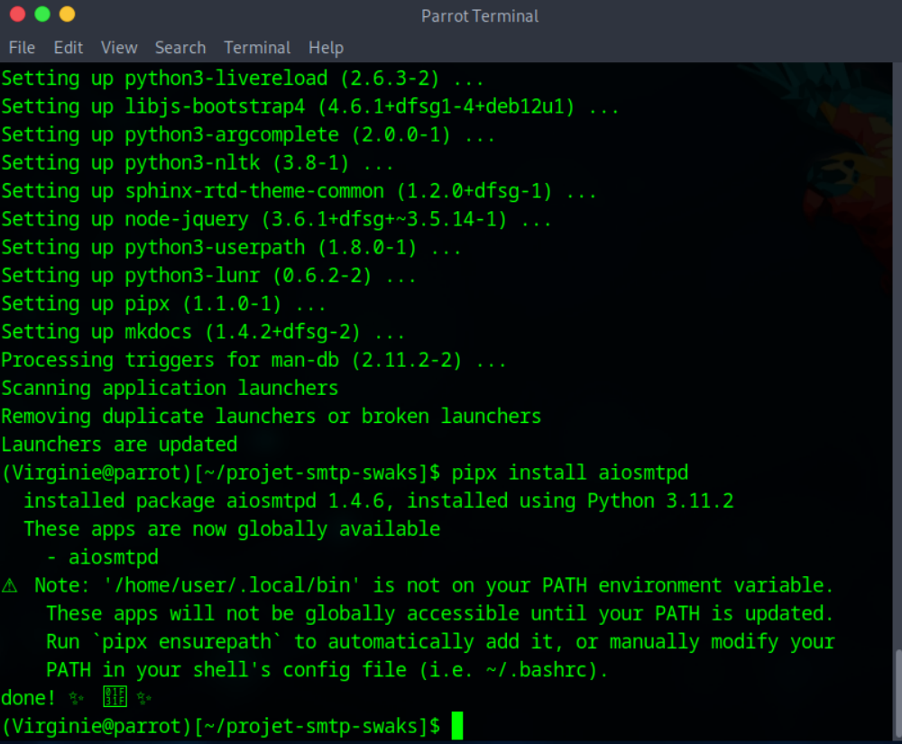
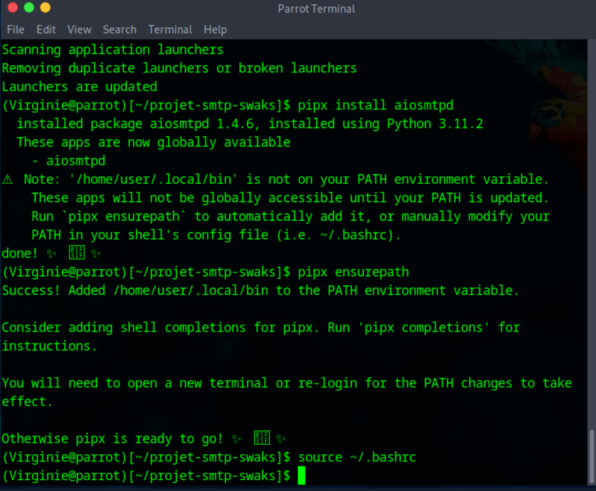
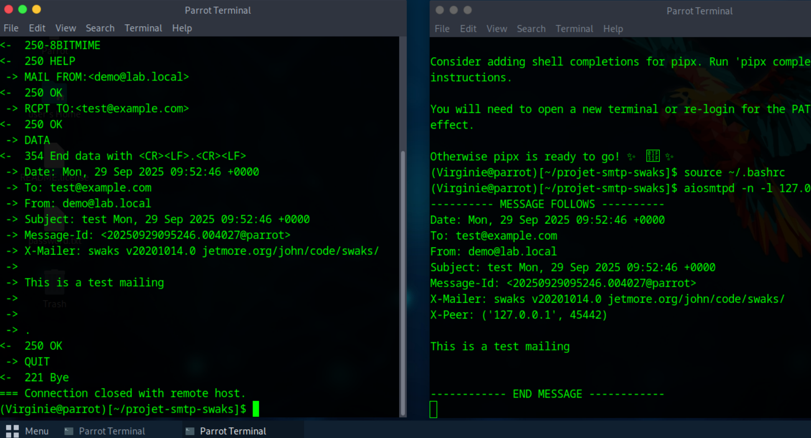
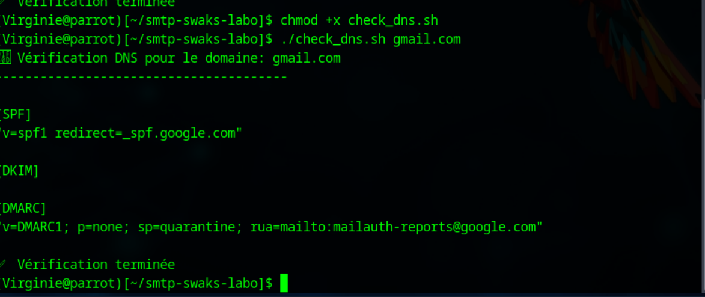

  <!-- Badge Actions cliquable -->
  

  <!-- Autres badges cliquables (optionnels) -->
  
  

<!-- Image de couverture (centrée) -->

  

<!-- Texte copyright et usage (centré) -->

© 2025 Virginie Lechene

  

---

<h1 align="center" style="font-size:50px; font-weight:bold;">
📧 Du spoofing à la sécurité des e-mails
</h1>

---

# 📧 Du spoofing à la sécurité des e-mails

**Laboratoire SMTP pédagogique avec Swaks — analyse du protocole, spoofing et protections e-mail**

**Niveau : intermédiaire — cybersécurité / sécurité réseau / sécurité e-mail**

> ⚠️ **Usage pédagogique uniquement**
>
> Tous les tests décrits dans ce projet sont réalisés en local, dans une VM Parrot OS ou dans un laboratoire isolé.
>
> Toute intervention sur un système tiers ou réel nécessite une **autorisation explicite préalable** (Rules of Engagement).

---

## Pré-requis minimum

- Connaissances Linux et réseau : **TCP/IP, DNS, SMTP**
- Maîtrise de la ligne de commande et des outils `swaks`, `dig` et `openssl`
- Connaissances des mécanismes **SPF, DKIM, DMARC** et **STARTTLS/TLS**

---

## 📌 Introduction

Ce projet propose un laboratoire pratique consacré au fonctionnement et à la sécurité du protocole **SMTP**.

Il permet d'étudier :

- le dialogue entre un client et un serveur SMTP ;
- les commandes fondamentales du protocole ;
- les risques d'usurpation de l'identité d'un expéditeur (**e-mail spoofing**) ;
- le rôle de **SPF**, **DKIM** et **DMARC** dans l'authentification des domaines et la politique de traitement des messages ;
- le rôle de **STARTTLS/TLS** dans la protection du transport des communications SMTP.

Le laboratoire utilise **Swaks** pour générer et observer des transactions SMTP et **aiosmtpd** pour mettre en place un serveur SMTP local contrôlé.

L'objectif est de passer de la théorie à la pratique en observant directement les échanges SMTP, en analysant les mécanismes de sécurité associés et en conservant des traces exploitables dans le cadre d'un rapport pédagogique.

> 🔐 **À retenir**
>
> **SPF, DKIM et DMARC** participent à l'authentification et aux politiques de sécurité liées aux domaines e-mail.
>
> **STARTTLS/TLS** protège principalement le transport des communications SMTP.
>
> Ces mécanismes sont complémentaires, mais remplissent des fonctions différentes.

## 📑 Sommaire

1. [Objectifs pédagogiques](#objectifs-pédagogiques)  
2. [Prérequis](#prérequis-vm-parrot-os--système-de-type-debian)  
3. [Installation](#installation)  
   - [pipx + aiosmtpd](#installer-pipx-puis-aiosmtpd-méthode-recommandée)  
   - [Création des dossiers](#créez-les-dossiers)  
4. [Démo SMTP](#démo-smtp---swaks--aiosmtpd-guide-pas-à-pas)  
   - [Démarrer le serveur SMTP](#1-démarrer-le-serveur-smtp-local-terminal-a)  
   - [Envoyer un e-mail de test](#2-envoyer-un-e-mail-de-test-avec-swaks-terminal-b)  
   - [Interpréter le dialogue SMTP](#3-interpréter-le-dialogue-smtp-ce-quil-faut-vérifier)  
   - [Sauvegarder les artefacts](#4-sauvegarder-et-vérifier-les-artefacts)  
   - [Test TLS / STARTTLS](#5-test-tls--starttls-conceptuel)  
5. [Vérification DNS](#6-vérification-dns-lecture-seule---spf--dkim--dmarc)  
6. [Nettoyage](#7-nettoyage)  
7. [Note de sécurité](#️-note-de-sécurité)  
8. [Test du script](#test-du-script)  
9. [Auteur & Licence](#auteur)  
   - [Licence](#licence)  
   - [Usage](#à-propos-de-lusage)  
   - [Droits sur les visuels](#droits-sur-les-visuels)

---

## Résumé
Ce projet montre comment :
- créer un **serveur SMTP local** (simulation avec `aiosmtpd`),  
- tester l’envoi d’e-mails avec `swaks`,  
- observer le **dialogue SMTP** côté client/serveur,  
- vérifier et interpréter les protections e-mail : **SPF, DKIM, DMARC, TLS**.

## Qu’est-ce que SMTP ?

**SMTP** (*Simple Mail Transfer Protocol*) est le protocole standard utilisé pour l’envoi de courriels sur Internet.  
Il définit comment un client (ex. un logiciel de messagerie ou un script) communique avec un serveur de messagerie pour transmettre un message électronique.  

✅ Points essentiels :  
- SMTP fonctionne en mode texte : les échanges se font sous forme de commandes et de réponses lisibles.  
- Par défaut, SMTP ne vérifie pas l’authenticité de l’expéditeur → c’est pourquoi il est vulnérable au **spoofing** (usurpation d’adresse e-mail).  
- Pour sécuriser les échanges, on ajoute des mécanismes comme **STARTTLS/TLS**, **SPF**, **DKIM** et **DMARC**.

---

## Qu’est-ce que Swaks ?

**Swaks** (*Swiss Army Knife for SMTP*) est un outil en ligne de commande conçu pour tester et diagnostiquer des serveurs SMTP.  
Il est particulièrement utilisé en sécurité et en administration système car il permet de :  
- simuler l’envoi d’un e-mail avec des paramètres personnalisés,  
- observer en détail le dialogue SMTP entre le client et le serveur,  
- tester des mécanismes de sécurité comme **STARTTLS**, **l'authentification SMTP**, **SPF/DKIM/DMARC**,  
- générer des traces exploitables pour un rapport d’audit ou un support de formation.

---

- **SPF** (Sender Policy Framework) : permet au propriétaire d’un domaine de définir quels serveurs sont autorisés à envoyer des e-mails en son nom.  
- **DKIM** (DomainKeys Identified Mail) : ajoute une signature cryptographique aux e-mails pour garantir que le message n’a pas été modifié et qu’il provient bien du domaine revendiqué.  
- **DMARC** (Domain-based Message Authentication, Reporting and Conformance) : combine SPF et DKIM, et précise aux serveurs destinataires comment traiter les e-mails qui échouent aux vérifications (surveillance, quarantaine ou rejet).  

---

## Objectifs pédagogiques
- Comprendre le dialogue SMTP (EHLO/HELO, MAIL FROM, RCPT TO, DATA).  
- Illustrer pourquoi SMTP, par défaut,permet l'usurpation d'expéditeur (spoofing).  
- Vérifier et interpréter SPF / DKIM / DMARC et STARTTLS/TLS.  
- Produire des artefacts (sorties swaks, logs) exploitables en audit pédagogique.

## ✅ Contenu du dépôt (extrait)
- `README.md` - introduction (ce fichier).  
- `docs/demo_smtp_swaks.md` - guide pas à pas (installation, création serveur local, tests).  
- `docs/protections_email.md` - explications SPF/DKIM/DMARC/TLS et recommandations.  
- `ROE_MINI.md` - modèle minimal Rules of Engagement (lecture obligatoire).  
- `scripts/run_demo.sh` - script safe (local only) : démarre le serveur local, lance swaks, sauvegarde les traces.  
- `artifacts/` - sorties de tests (texte).  

## Règles d'or (lecture obligatoire)
- N'exécutez jamais ces scripts sur des hôtes tiers ou en production sans autorisation explicite.  
- Utilisez `example.com` dans la documentation publique et anonymisez les données réelles dans `artifacts/`.  
- Conservez les preuves dans `artifacts/` et anonymisez-les avant publication.

## Prochaines étapes rapides
1. Lisez `ROE_MINI.md`.  
2. Suivez `docs/demo_smtp_swaks.md` pour lancer la démo en local (Parrot OS).  
3. Sauvegardez les artefacts générés dans `artifacts/`.  
4. Complétez `docs/protections_email.md` avec vos conclusions.

---

# Démo SMTP - Swaks + aiosmtpd (guide pas à pas)

> Tout se fait **en local** sur une VM Parrot OS ou dans un laboratoire isolé. N’exécutez jamais ces procédures sur des systèmes tiers sans autorisation écrite préalable.

## Objectifs
Montrer comment:
-  créer un serveur SMTP local (aiosmtpd) pour capter des messages de test.
-  envoyer des e-mails de test avec `swaks`.
-  observer et interpréter le dialogue SMTP (client ↔ serveur).
-  sauvegarder des artefacts (traces) exploitables pour un rapport pédagogique.

---

## Prérequis (VM Parrot OS / système de type Debian)

- Système à jour :  
sudo apt update && sudo apt upgrade -y

-  Installer les outils de base :  
sudo apt install -y swaks dnsutils openssl git

## ✅ Installation - capture
**Capture d'écran - installation de `swaks`**

  

*Figure : sortie montrant la commande `sudo apt install swaks` (swaks déjà installé sur la VM Parrot).*

---

# Installer pipx puis aiosmtpd (méthode recommandée) :

sudo apt install -y pipx
pipx ensurepath
# relancer le shell si nécessaire :
   source ~/.bashrc
  
pipx install aiosmtpd

### ✅ Capture d'écran - installation de `aiosmtpd` avec pipx

  

**Figure :** sortie montrant la commande `pipx install aiosmtpd` et le message de succès  
(aiosmtpd installé et disponible localement).

**Remarque :** si `pipx` n’est pas souhaité, vous pouvez utiliser un environnement virtuel Python :  

python3 -m venv .venv  
source .venv/bin/activate  
pip install --upgrade pip  
pip install aiosmtpd  

Créez les dossiers :

mkdir -p ~/projet-smtp-swaks/{docs,scripts,artifacts}    
cd ~/projet-smtp-swaks

1) ✅ Démarrer le serveur SMTP local (Terminal A)

Lancez aiosmtpd pour écouter sur l’interface locale (port 1025) :

aiosmtpd -n -l 127.0.0.1:1025

•	-n : ne pas daemoniser (le serveur reste au premier plan et affiche les messages reçus).  
•	Laissez ce terminal ouvert : il affichera les messages au format brut (en-têtes + corps).

*Figure : sortie montrant la commande `pipx install aiosmtpd` suivie de `pipx ensurepath`.*

** ✅ Capture d’écran - ajout au PATH et rechargement du shell**

  

*Figure : commande `pipx ensurepath` puis `source ~/.bashrc`.*

---

2) ✅ Envoyer un e-mail de test avec Swaks (Terminal B)

Dans un autre terminal, exécutez :

cd ~/projet-smtp-swaks  

swaks --to test@example.com \
      --from demo@lab.local \
      --server 127.0.0.1 --port 1025 \
      --header "Subject: Test SMTP local" \
      --body "Ceci est un test local. Date: $(date -u)" \
      --timeout 15 \
  | tee artifacts/test_local_aiosmtpd_$(date +%Y%m%d_%H%M%S).txt

Vous obtiendrez :  
	•	la trace complète de la transaction SMTP dans la sortie standard (affichée par swaks).    
	•	un fichier texte horodaté dans artifacts/ contenant cette sortie (utile pour le rapport).    

** ✅ Capture d’écran - envoi d’un e-mail de test avec Swaks**

  

*Figure : trace complète du dialogue SMTP (`MAIL FROM`, `RCPT TO`, `DATA`, `250 OK`) observée avec Swaks et le serveur local aiosmtpd.*

---

3) ✅ Interpréter le dialogue SMTP (ce qu’il faut vérifier)  

Lors d’une transaction réussie, observez les étapes suivantes :  
	•	220 : salutation du serveur (prêt)  
	•	EHLO / HELO : présentation du client (capabilities)  
	•	MAIL FROM:  adresse déclarée de l’expéditeur (champ déclaratif)  
	•	RCPT TO:  destinataire déclaré  
	•	DATA → 354 : serveur attend le corps du message  
	•   → 250 OK : message accepté  
	•	QUIT → 221 : fin de session  

Remarque pédagogique : SMTP de base n’authentifie pas le champ MAIL FROM.  
C’est pourquoi SPF/DKIM/DMARC et l’authentification sont nécessaires côté destinataire.

---

4) ✅ Sauvegarder et vérifier les artefacts

Lister les artefacts :  

ls -lh artifacts/  

Afficher le contenu d’un artefact :  

less artifacts/test_local_aiosmtpd_*.txt  

Conservez ces fichiers dans le dépôt (ou hors dépôt si sensibles) pour preuve et reporting.    

Anonymisez avant publication.

---

5) ✅ Test TLS / STARTTLS (conceptuel)

Si vous souhaitez observer la négociation TLS avec un serveur externe (ex. smtp.gmail.com), utilisez :    

swaks --to test@example.com    
      --from demo@lab.local \    
      --server smtp.gmail.com --port 587   
      --starttls --timeout 20 \    
| tee artifacts/test_starttls_$(date +%Y%m%d_%H%M%S).txt  

Attention : de nombreux fournisseurs exigent une authentification pour la remise ; la connexion peut aussi être bloquée par la NAT/FAI.  
Ce test sert principalement à vérifier la présence et la négociation TLS.

---

## ✅ Test du script

 Le script `check_dns.sh` a été exécuté dans une VM Parrot OS pour vérifier les enregistrements DNS (SPF, DKIM, DMARC).  
✅ Le script fonctionne correctement comme prévu.

  

## ✅ Description des scripts

Ce projet contient deux scripts Bash permettant de vérifier les enregistrements DNS relatifs à la sécurité des emails : **SPF**, **DKIM** et **DMARC**.

🔹 Script : `check_dns.sh`  

Ce script permet de vérifier les enregistrements **SPF / DKIM / DMARC** pour **un seul domaine**.  
    
./check_dns.sh  gmail.com      

🔹 Script : `check_dns_multi.sh`  

Ce script Bash permet de **vérifier les enregistrements DNS SPF, DKIM, et DMARC** pour **plusieurs domaines**.  

./check_dns_multi.sh  gmail.com  yahoo.com  outlook.com  

---

6) ✅ Vérification DNS (lecture seule) - SPF / DKIM / DMARC  

Exemples avec dig (remplacez example.com par le domaine de test) :  

dig +short MX example.com  
dig +short TXT example.com             # rechercher v=spf1  
dig +short TXT _dmarc.example.com      # enregistrement DMARC  
dig +short TXT selector._domainkey.example.com  # test DKIM (selector)  

Interprétez :  
	•	Absence de SPF/DKIM/DMARC → domaine vulnérable au spoofing.    
	•	DMARC p=none → monitoring;    
	p=quarantine/p=reject → enforcement.  

---

7) ✅ Nettoyage  

Si aiosmtpd a été lancé en arrière-plan,    
arrêtez-le :  
pkill -f aiosmtpd || true  

---

## ⚠️ Comment un attaquant peut usurper une adresse e-mail (explication non technique)    

Note : un futur module présentera, à des fins pédagogiques et sur un banc d’essai contrôlé, les techniques d’usurpation d’adresse e-mail et les contre-mesures associées.    

Un attaquant cherche simplement à **faire croire** qu’un message provient d’une source de confiance (banque, collègue, service). Pour cela, il manipule les éléments visibles du message (expéditeur, objet, contenu) afin de tromper la vigilance du destinataire. Les motivations courantes sont la fraude, le phishing, l’ingénierie sociale ou la diffusion de logiciels malveillants.  

Cela fonctionne parce que le protocole d’envoi d’e-mails, dans sa forme basique, **ne vérifie pas automatiquement** que l’expéditeur est bien celui qu’il prétend être.

---

> 🛡️ **Note de sécurité :**  
> Pour protéger efficacement une adresse e-mail et éviter l’usurpation (spoofing), il est essentiel de configurer les mécanismes suivants au niveau de votre domaine :    
> - **SPF** : définit quels serveurs sont autorisés à envoyer des e-mails pour votre domaine.    
> - **DKIM** : ajoute une signature numérique aux messages pour garantir leur intégrité et leur authenticité.    
> - **DMARC** : combine SPF et DKIM et indique aux serveurs destinataires comment traiter les messages non conformes (surveillance, quarantaine ou rejet).    

---

✍️ Auteur : *Virginie Lechene*

---

## Licence
Le script est publié sous la licence MIT.

---

## À propos de l’usage
Ce projet est destiné exclusivement à des fins pédagogiques, notamment dans le cadre de :
- d’une formation en cybersécurité,
- de tests d’intrusion légaux (pentest),
- d’analyses réseau dans un environnement contrôlé.

⚠️ L’auteure ne cautionne ni n’autorise l’utilisation de ce script en dehors d’un cadre légal strictement défini.
Toute utilisation non conforme est interdite et relève uniquement de la responsabilité de l’utilisateur.

---

## 📷 Droits sur les visuels

Les visuels de ce dépôt sont protégés par la licence CC BY-ND 4.0.
Attribution obligatoire – Modification interdite.

© 2026 Virginie Lechene

